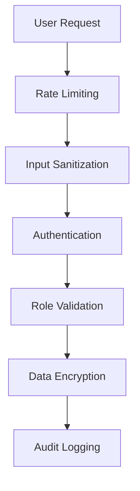

# ZocMLM - Modern Network Marketing Platform

[](https://nextjs.org/)
[](https://opensource.org/licenses/MIT)
[](SECURITY.md)

A feature-rich MLM platform with advanced network management, gamification elements, and crypto integration.


## ✨ Key Features

### Core MLM Engine
- 🌐 Binary Tree Visualization with Real-time Updates
- 💸 Multi-tier Commission System (Direct, Binary, Leadership)
- 🏆 12-Level Rank Advancement System
- 📊 Advanced Network Analytics Dashboard
- 🔄 Automated Genealogy Compression
- 📈 Performance Forecasting Tools

### Gamification System
- 🎮 Interactive Achievement System
- 🏅 NFT-based Badges & Rewards
- 📜 Progressive Training Modules
- 🏁 Seasonal Team Challenges
- 📊 Live Leaderboards
- 🎯 Skill Tree Development Paths

### Financial Ecosystem
- 💰 Multi-currency Wallet System
- ₿ Crypto Integration (BTC, ETH, USDT)
- 🏦 Automated Payout Management
- 📉 Real-time Market Data Feeds
- 🔒 Smart Contract-based Transactions
- 📑 Comprehensive Audit Trails

### Security & Compliance
- 🔐 Zero-Trust Architecture
- 🛡️ GDPR & CCPA Compliance Tools
- 📜 Automated Legal Document Generation
- 🔍 Real-time Suspicious Activity Monitoring
- 🛂 Multi-factor Authentication
- 🔄 Session Rotation System

## 👥 Role-Based Features

### Admin Role
- 🕹️ Network Structure Overrides
- ⚖️ Dispute Resolution Center
- 📈 Performance Benchmarking
- 🔄 Bulk User Operations
- 🛠️ System Configuration Manager
- 📊 Advanced Reporting Suite

### User/Investor Role
- 🌍 Global Network Viewer
- 💹 Personal Performance Dashboard
- 🎓 Interactive Training Portal
- 🤖 Automated Trading Bots
- 📱 Mobile-First Interface
- 🗂️ Document Management System

### System Manager
- 🔄 Database Version Control
- 🚨 Real-time System Monitoring
- ⚡ Performance Optimization Tools
- 🔄 CI/CD Pipeline Integration
- 📈 Capacity Planning Dashboard
- 🔄 Failover Management

## 🛠️ Technology Stack

- **Frontend**: Next.js 14, Tailwind CSS 3.4, React 18
- **Backend**: Node.js 20, Express, Supabase
- **Database**: PostgreSQL 15, Redis 7
- **Security**: JWT, OAuth 2.1, CSP 3.0
- **Blockchain**: Solidity, Web3.js, IPFS
- **Analytics**: Apache Superset, Metabase

## 🚀 Installation

```bash
# Clone repository
git clone https://github.com/yourorg/zocmlm.git
cd zocmlm

# Install dependencies
npm install

# Configure environment
cp .env.example .env.local

# Start development server
npm run dev
```

**Production Setup:** See [INSTALLATION.md](INSTALLATION.md) for cPanel deployment guide

## ⚙️ Configuration

### Essential Environment Variables
```env
NEXT_PUBLIC_API_URL=https://api.yourdomain.com
SUPABASE_URL=your-supabase-url
SUPABASE_KEY=your-supabase-key
BLOCKCHAIN_RPC_URL=https://mainnet.infura.io/v3/your-key
ENCRYPTION_SECRET=your-32-char-secret
```

## 🔒 Security



## 📚 API Documentation

Explore our interactive API docs:  
`https://api.yourdomain.com/docs`

```bash
# Generate API documentation locally
npm run generate-docs
```

## 🤝 Contributing

1. Fork the repository
2. Create feature branch (`git checkout -b feature/amazing-feature`)
3. Commit changes (`git commit -m 'Add amazing feature'`)
4. Push to branch (`git push origin feature/amazing-feature`)
5. Open Pull Request

## 📄 License

Distributed under the MIT License. See `LICENSE` for more information.

## 🎓 Acknowledgments

- Next.js Documentation Team
- Tailwind CSS Community
- Faker.js Maintainers
- Web3.js Development Team
